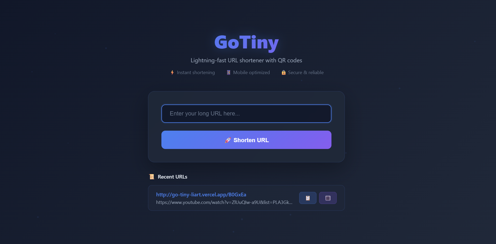
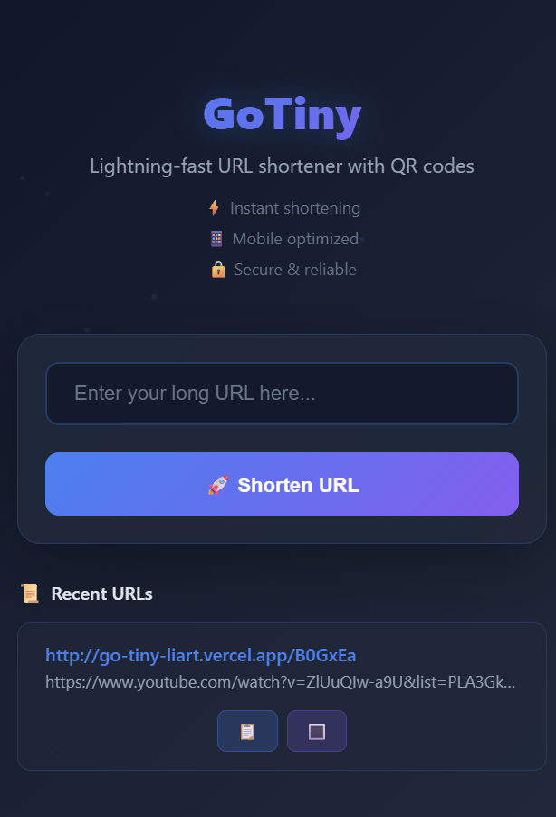

  
  # 🔗 GoTiny
  
  **Lightning-fast URL shortener with modern design**
  
  [](https://choosealicense.com/licenses/mit/)
  [](https://nodejs.org/)
  [](https://expressjs.com/)
  []()
  []()

  [Live Demo](https://go-tiny-liart.vercel.app/) • [Report Bug](https://github.com/RajdeepKushwaha5/GoTiny/issues) • [Request Feature](https://github.com/RajdeepKushwaha5/GoTiny/issues)




</div>

---

## 🌟 About GoTiny

**GoTiny** is a sleek, lightning-fast URL shortener designed for simplicity and speed. With no sign-up required, users can instantly transform long URLs into short, shareable links complete with QR codes and copy-to-clipboard functionality.

### ✨ Why GoTiny?

- **🚀 Instant Results** - Real-time URL shortening with zero delay
- **🎨 Modern UI** - Professional dark theme with smooth animations
- **📱 Universal Access** - Works perfectly on any device, any screen size
- **🔒 Privacy First** - No accounts, no tracking, just pure functionality
- **⚡ Lightweight** - Optimized for speed and performance

---

## 🎯 Key Features

<div align="center">
  <table>
    <tr>
      <td align="center">
        <h3>⚡ Real-time Shortening</h3>
        <p>Instant URL conversion with<br/>lightning-fast response times</p>
      </td>
      <td align="center">
        <h3>📋 One-Click Copy</h3>
        <p>Copy shortened URLs to clipboard<br/>with visual feedback</p>
      </td>
      <td align="center">
        <h3>🔳 QR Code Generation</h3>
        <p>Automatic QR codes for every<br/>shortened URL</p>
      </td>
    </tr>
    <tr>
      <td align="center">
        <h3>📜 Session History</h3>
        <p>Track your recent URLs<br/>during current session</p>
      </td>
      <td align="center">
        <h3>📱 Fully Responsive</h3>
        <p>Perfect experience on mobile,<br/>tablet, and desktop</p>
      </td>
      <td align="center">
        <h3>🚫 No Authentication</h3>
        <p>Zero friction - just paste,<br/>click, and go!</p>
      </td>
    </tr>
  </table>
</div>

### 🎨 Design Highlights

- **Dark Theme** - Professional gradient background with animated particles
- **Glass Morphism** - Modern frosted glass effects throughout
- **Smooth Animations** - Buttery smooth transitions and hover effects
- **Interactive Feedback** - Visual responses to all user actions
- **Custom Favicon** - Branded GoTiny icon in browser tabs

---

## 🖼️ Screenshots

<div align="center">
  
  ### 🖥️ Desktop Experience
  
  
  ### 📱 Mobile Experience
  
  
  ### 🔳 QR Code Modal
  

</div>

---

## 🛠️ Tech Stack

<div align="center">

| Category | Technology | Version |
|----------|------------|---------|
| **Backend** | Node.js | 16+ |
| **Framework** | Express.js | 4.18+ |
| **Frontend** | Vanilla JavaScript | ES6+ |
| **Styling** | Pure CSS3 | - |
| **Storage** | In-Memory | Session-based |
| **QR Codes** | QR Server API | - |
| **HTTP Client** | Fetch API | - |

</div>

### 📁 Project Structure
```
GoTiny/
├── 📁 public/
│   ├── 🔗 favicon.svg          # Custom GoTiny favicon
│   └── 📄 index.html           # Complete single-page app
├── 📄 server.js                # Express server & API
├── 📄 package.json             # Dependencies & scripts
├── 📄 test.js                  # API testing utilities
└── 📖 README.md               # Project documentation
```

---

## 🚀 Quick Start

### Prerequisites

- **Node.js** 16.0 or higher
- **npm** or **yarn**

### 📦 Installation

1. **Clone the repository**
   ```bash
   git clone https://github.com/yourusername/gotiny.git
   cd gotiny
   ```

2. **Install dependencies**
   ```bash
   npm install
   ```

3. **Start the server**
   ```bash
   npm start
   ```

4. **Open your browser**
   ```
   http://localhost:5000
   ```

### 🔧 Development Mode

For development with auto-restart:
```bash
npm run dev
```

---

## 💡 Usage Guide

### Basic URL Shortening

1. **Paste your long URL** into the input field
   ```
   https://very-long-example-url.com/with/many/parameters?query=example
   ```

2. **Click "🚀 Shorten URL"**

3. **Get your short link instantly**
   ```
   http://localhost:5000/aB3x9K
   ```

### Advanced Features

#### 📋 Copy to Clipboard
- Click the **"📋 Copy"** button next to any shortened URL
- Automatic clipboard copying with success notification

#### 🔳 QR Code Generation
- Click the **"🔳 QR Code"** button to generate a scannable QR code
- Perfect for sharing links via mobile devices

#### 📜 Session History
- View all URLs shortened in your current session
- Quick access to copy or generate QR codes for previous links

### ⌨️ Keyboard Shortcuts

| Shortcut | Action |
|----------|--------|
| `Ctrl/Cmd + Enter` | Submit URL for shortening |
| `Escape` | Close QR code modal |

---

## 🌐 API Documentation

### Endpoints

#### `POST /api/shorten`
Shorten a long URL

**Request:**
```json
{
  "originalUrl": "https://example.com/very/long/url"
}
```

**Response:**
```json
{
  "shortUrl": "http://localhost:5000/aB3x9K",
  "originalUrl": "https://example.com/very/long/url",
  "shortCode": "aB3x9K",
  "createdAt": "2025-08-17T10:30:00.000Z",
  "clicks": 0
}
```

#### `GET /:shortCode`
Redirect to original URL

**Example:**
```bash
curl http://localhost:5000/aB3x9K
# Redirects to original URL
```

#### `GET /api/stats/:shortCode`
Get URL statistics

**Response:**
```json
{
  "originalUrl": "https://example.com/very/long/url",
  "shortCode": "aB3x9K",
  "createdAt": "2025-08-17T10:30:00.000Z",
  "clicks": 42
}
```

---

## 🚀 Deployment

### Vercel (Recommended)

1. **Install Vercel CLI**

   ```bash
   npm i -g vercel
   ```

2. **Deploy**

   ```bash
   vercel --prod
   ```

3. **Environment Variables**
   - No environment variables required for basic deployment
   - PORT is automatically set by Vercel

### Manual Deployment Steps

1. **Prepare for deployment**

   ```bash
   npm install --production
   ```

2. **Test locally**

   ```bash
   npm start
   # Verify at http://localhost:5000
   ```

3. **Deploy to your chosen platform**

### Render

1. **Connect your GitHub repository**
2. **Set build command:** `npm install`
3. **Set start command:** `npm start`
4. **Deploy**

### Railway

1. **Connect repository**
2. **Add environment variables if needed**
3. **Deploy automatically**

### Environment Variables

| Variable | Description | Default |
|----------|-------------|---------|
| `PORT` | Server port | `5000` |

---

## 📱 Mobile Optimization

GoTiny is designed mobile-first with:

- **Touch-friendly interface** - Large buttons and touch targets
- **Responsive design** - Adapts to any screen size
- **Fast loading** - Optimized for mobile networks
- **PWA support** - Can be installed as a mobile app
- **Gesture support** - Swipe and touch interactions

---

## 🔮 Future Enhancements

- [ ] **Custom Aliases** - Let users create memorable short URLs
- [ ] **Analytics Dashboard** - Detailed click tracking and statistics
- [ ] **Bulk URL Shortening** - Process multiple URLs at once
- [ ] **Link Expiration** - Set automatic expiry dates
- [ ] **Password Protection** - Secure sensitive links
- [ ] **API Rate Limiting** - Prevent abuse
- [ ] **Database Integration** - Persistent storage option
- [ ] **Custom Domains** - Brand your short links
- [ ] **Link Preview** - Safe preview before redirecting
- [ ] **Dark/Light Theme Toggle** - User preference options

---

## 🤝 Contributing

We welcome contributions! Here's how you can help:

### 🐛 Bug Reports
1. **Check existing issues** first
2. **Create detailed bug report** with steps to reproduce
3. **Include screenshots** if applicable

### ✨ Feature Requests
1. **Search existing requests** first
2. **Describe the feature** and its benefits
3. **Provide use cases** and examples

### 💻 Code Contributions

1. **Fork the repository**
   ```bash
   git fork https://github.com/yourusername/gotiny.git
   ```

2. **Create feature branch**
   ```bash
   git checkout -b feature/amazing-feature
   ```

3. **Make changes and commit**
   ```bash
   git commit -m "Add amazing feature"
   ```

4. **Push and create PR**
   ```bash
   git push origin feature/amazing-feature
   ```

### 📋 Development Guidelines

- **Code Style:** Use ESLint and Prettier
- **Commits:** Follow conventional commit format
- **Testing:** Add tests for new features
- **Documentation:** Update README for significant changes

---

## 📄 License

This project is licensed under the **MIT License** - see the [LICENSE](LICENSE) file for details.

```
MIT License

Copyright (c) 2025 GoTiny

Permission is hereby granted, free of charge, to any person obtaining a copy
of this software and associated documentation files (the "Software"), to deal
in the Software without restriction, including without limitation the rights
to use, copy, modify, merge, publish, distribute, sublicense, and/or sell
copies of the Software...
```

---

## 🙏 Acknowledgments

- **QR Server API** - For reliable QR code generation
- **Express.js Community** - For the robust web framework
- **Open Source Community** - For inspiration and tools

---

## 📞 Support

<div align="center">

**Need help?**

[](https://github.com/RajdeepKushwaha5/GoTiny/issues)
[](mailto:rajdeepsingh10789@gmail.com)

**Found a bug?** [Report it here](https://github.com/RajdeepKushwaha5/GoTiny/issues)  
**Have a suggestion?** [Share it with us](https://github.com/RajdeepKushwaha5/GoTiny/issues)

</div>

---

<div align="center">
  
  **⭐ Star this repo if you find it helpful!**
  
  Made with ❤️ by Rajdeep Singh
  
  [🔗 GoTiny](https://go-tiny-liart.vercel.app/) • [📖 Docs](https://github.com/RajdeepKushwaha5/GoTiny/blob/main/README.md) • [💬 Discord](https://discord.gg/)

</div>


